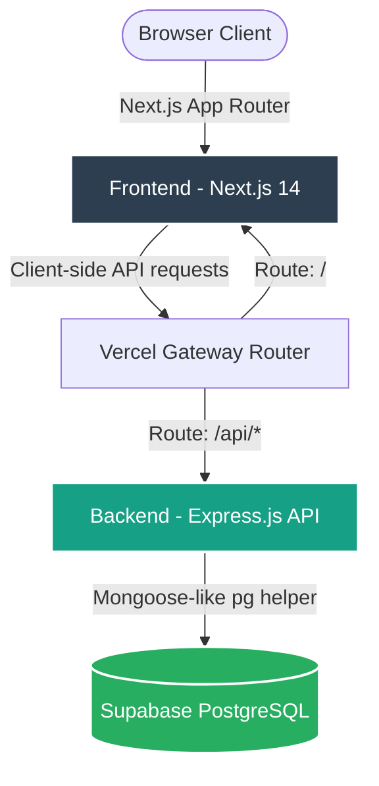

# RentEase - Furniture & Appliance Rental Platform
## Detailed Project Report

---

## 📋 Executive Summary
**RentEase** is a modern, premium full-stack web application designed for renting furniture and home appliances. The platform caters to three user roles (Customers, Vendors, and Admins) and handles the entire lifecycle of leasing—from catalog browsing and tenure-based checkout (with a simulated holographic payment card) to active lease management, lease extension/returns, and maintenance ticket scheduling.

---

## 🏗️ System Architecture & Technology Stack

RentEase is built using a modern decoupled monorepo architecture:



### 1. Frontend
*   **Framework:** Next.js 14 (App Router)
*   **Styling:** Tailwind CSS + Vanilla CSS variables for dark-mode compatibility and a modern aesthetic.
*   **Icons:** Lucide React
*   **Networking:** Axios (with interceptors to automatically attach JWT authorization headers from localStorage).

### 2. Backend
*   **Runtime:** Node.js
*   **Framework:** Express.js
*   **Authentication:** JSON Web Tokens (JWT) + BCryptJS for password hashing.
*   **Middleware:** CORS, Express JSON, Express URL-Encoded parser.

### 3. Database Layer
*   **Production:** **Supabase Cloud (PostgreSQL)** database.
*   **Simulation Engine:** A schema-agnostic simulation helper that maps Mongoose-style MongoDB CRUD operations to flat relational PostgreSQL tables (`users`, `products`, `rentals`, `maintenance_requests`) utilizing the JSONB column data type.

---

## 📂 Project Structure

```text
RentEase/
├── backend/                       # Express.js REST API
├── backend/config/
│   └── db.js                      # Database Pool Connector & Mongoose-like simulation helper
├── backend/controllers/           # Auth, Products, Rentals, Maintenance handlers
├── backend/middleware/            # Protect routes & Role Authorizer
├── backend/routes/                # API endpoints
├── backend/scripts/
│   ├── seed.js                    # Database seeder (Supabase tables initialization and load)
│   └── debug-register.js          # DB verification script
├── backend/.env                   # Environment credentials
├── backend/server.js              # Main server entrypoint
├── backend/vercel.json            # Backend service deployment configuration
├── frontend/                      # Next.js Application
│   ├── app/                       # Page-based App Router layout
│   ├── components/                # Reusable UI elements (Header, Footer, Product Cards)
│   ├── hooks/                     # Custom react hooks (Cart, etc.)
│   ├── services/
│   │   └── api.js                 # Axios API Client instance
│   └── package.json               # Frontend dependencies
├── DEPLOYMENT.md                  # Comprehensive cloud setup guide
└── vercel.json                    # Root monorepo deployment config
```

---

## 💾 Data Modeling (JSONB Document Store Simulation)

The application simulates a MongoDB schema model for four distinct collections on top of PostgreSQL, implemented dynamically for Supabase PostgreSQL tables using a JSONB column (`data`) keyed by a primary key (`_id`):

### 1. Users
Stores user profiles, roles, and hashed credentials.
```json
{
  "_id": "usr_customer01",
  "name": "John Doe",
  "email": "user@rentease.com",
  "password": "$2a$10$hashedPassword...",
  "role": "user", // "user" | "vendor" | "admin"
  "phone": "+1 (555) 728-1934",
  "address": "Apartment 4B, 120 W 81st St, New York, NY 10024",
  "createdAt": "2026-06-28T07:13:51.000Z"
}
```

### 2. Products
Defines listing catalog, pricing, categories, and inventory.
```json
{
  "_id": "prod_fur01",
  "title": "Nordic 3-Seater Fabric Sofa",
  "category": "furniture", // "furniture" | "appliances"
  "description": "Premium comfort sofa...",
  "monthlyRent": 45,
  "securityDeposit": 150,
  "images": ["https://images.unsplash.com/..."],
  "tenureOptions": [3, 6, 12, 24], // Available lease durations in months
  "stock": 8,
  "city": "New York",
  "availability": true,
  "vendorId": "usr_vendor01"
}
```

### 3. Rentals
Manages rental transactions and lease durations.
```json
{
  "_id": "rent_01a2b3c",
  "userId": "usr_customer01",
  "productId": "prod_fur01",
  "tenure": 12, // Selected months
  "monthlyRent": 45,
  "securityDeposit": 150,
  "startDate": "2026-06-28T08:14:00.000Z",
  "endDate": "2027-06-28T08:14:00.000Z",
  "status": "active", // "active" | "extended" | "returned"
  "deliveryAddress": "Apartment 4B, 120 W 81st St, New York, NY 10024"
}
```

### 4. Maintenance Requests
Tracks support and repair requests filed by renters.
```json
{
  "_id": "maint_987x",
  "rentalId": "rent_01a2b3c",
  "userId": "usr_customer01",
  "issueType": "repair",
  "description": "Slight tear on the sofa lining.",
  "status": "pending", // "pending" | "scheduled" | "resolved"
  "preferredDate": "2026-07-02T10:00:00.000Z"
}
```

---

## ⚡ Improvements & Issues Resolved

During implementation, we identified and successfully resolved several critical issues:

### 1. Windows Execution Policy Resolution (`.ps1` blocking)
*   **Issue:** Standard Windows terminals blocked the execution of script commands (`npm` and `npx`) due to default execution policies.
*   **Resolution:** Modified run targets to call `node` scripts directly (e.g. `node scripts/seed.js`) or utilized `-ExecutionPolicy Bypass` command parameters in PowerShell.

### 2. Absolute Path Environment Resolution
*   **Issue:** When running standalone scripts (like `seed.js`) from different working directories, the `.env` credentials were not loaded, causing the database to silently default to local JSON DB.
*   **Resolution:** Configured `dotenv` inside [backend/config/db.js](file:///c:/Users/hp/OneDrive/Desktop/RentEase%20%E2%80%93%20Furniture%20&%20Appliance%20Rental%20Platform/backend/config/db.js) using an absolute path reference relative to the directory:
    ```javascript
    require('dotenv').config({ path: path.join(__dirname, '../.env') });
    ```

### 3. Industry-Grade Database Health Checking
*   **Issue:** The backend health probe endpoint (`/api/health`) previously returned hardcoded `database: 'local-json-datastore'` and did not verify actual connection health, which is dangerous for production deployments.
*   **Resolution:** Developed and integrated `checkDbHealth` in the DB helper to perform live `SELECT NOW()` queries against Supabase. The `/api/health` endpoint now dynamically reports connection state, providers, timestamps, and error logs if the database degrades.

---

## 🌐 Production Deployment Architecture

To host RentEase completely **free** in production, the project utilizes the Vercel routing configuration:

### The Vercel Routing Configuration (`vercel.json`)
The [vercel.json](file:///c:/Users/hp/OneDrive/Desktop/RentEase%20%E2%80%93%20Furniture%20&%20Appliance%20Rental%20Platform/vercel.json) file at the root enables Vercel to compile and host both directories under the same domain:
```json
{
  "version": 2,
  "builds": [
    {
      "src": "frontend/package.json",
      "use": "@vercel/next"
    },
    {
      "src": "backend/server.js",
      "use": "@vercel/node"
    }
  ],
  "routes": [
    {
      "src": "/api/(.*)",
      "dest": "backend/server.js"
    }
  ]
}
```

*   **Same-Domain Routing:** Frontend requests point to `/api/...` which are redirected internally by Vercel to your Node backend. This eliminates browser CORS issues entirely.

---

## 🛠️ Verification & Operations Checklist

### Local Running Instructions
1.  **Configure environment:** Add your Supabase PostgreSQL credentials to `backend/.env`.
2.  **Start Backend (Port 5000):**
    ```bash
    cd backend
    node server.js
    ```
3.  **Start Frontend (Port 3000):**
    ```bash
    node dev-runner.js
    ```

### Production Deployment Verification
*   **Verify Backend:** Confirm healthy JSON is returned from `https://your-domain.vercel.app/api/health`.
*   **Verify Login:** Sign in with `user@rentease.com` / `user123` to test JWT issuance and retrieval.
*   **Verify Database Access:** Confirm write operations by registering a new account and checking its creation inside the Supabase Table Editor.
